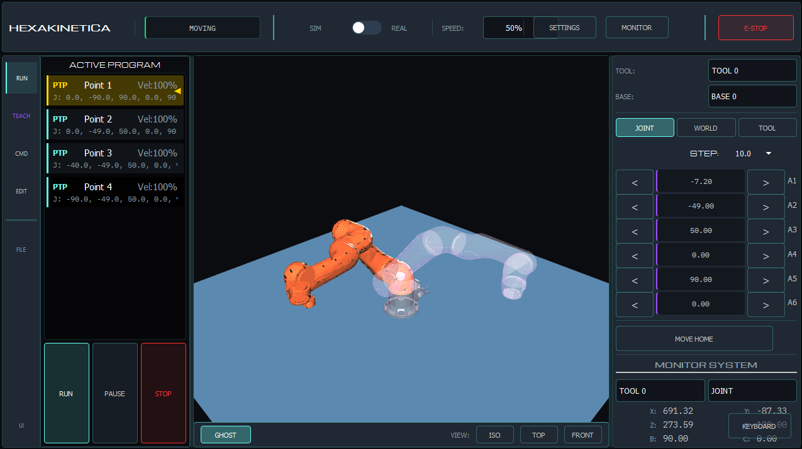
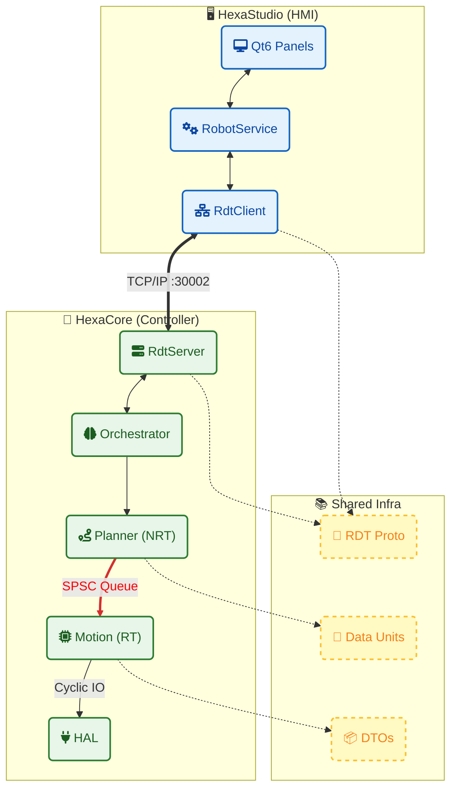

# RDT-core-next

## Soon

# HexaMotion: Industrial Robot Control System

[](https://github.com/hexakinetica/hexamotion/actions)
[](https://isocpp.org/)
[](https://www.gnu.org/licenses/agpl-3.0)
[](https://www.qt.io/)

**A high-reliability, modular C++20 architecture for industrial manipulator control.**

HexaMotion is a production-grade control system designed for 6-axis industrial robots. It features a strict separation between Real-Time (RT) execution and Non-Real-Time (NRT) planning, connected via a robust TCP/IP bridge to a decoupled HMI (`HexaStudio`).

> **⚠️ LICENSE WARNING:** This project is licensed under the **GNU Affero General Public License v3 (AGPLv3)**. If you use this software (or modified versions of it) to provide a service over a network, you must make the source code available to all users of that service.

---

### System Architecture

The system is built on a **Network-First** philosophy. The Controller (`HexaCore`) and the Interface (`HexaStudio`) share no memory; they share only data structures definitions (`shared`). This ensures that a UI crash never brings down the robot control loop.


---

### 📦 Module Breakdown

The solution is divided into three main scopes: **HexaMotion** (Controller), **HexaStudio** (HMI), and **Shared** libraries.

#### 1. HexaMotion (The Controller)
Located in `HexaMotion/modules/`. This is the brain of the robot, designed to run on embedded IPCs or real-time Linux kernels.

| Module | Architectural Role & Description |
| :--- | :--- |
| **`controller`** | **The Orchestrator**. It manages the global state machine (Idle, Run, Error), processes incoming RDT network commands, and coordinates the startup sequence. It acts as the "boss" of the other modules. |
| **`motion_manager_rt`** | **The Heartbeat (Real-Time)**. Runs in a high-priority thread (250Hz+). It pulls pre-calculated points from the queue, enforces safety limits (Following Error), and drives the HAL. **It must never block or allocate memory.** |
| **`planning_nrt`** | **The Brain (Non-Real-Time)**. Responsible for generating smooth trajectories (Trapezoidal/S-Curve). It handles heavy mathematical operations asynchronously, ensuring the RT loop is never starved of data. |
| **`kinematics_nrt`** | **Math Engine**. Wraps **Orocos KDL** to provide Forward (FK) and Inverse (IK) kinematics. It isolates the rest of the system from specific math library dependencies. |
| **`hardware_hal`** | **Hardware Abstraction**. Provides a unified `IDriver` interface. Includes: <br>• **SimDriver**: Internal physics simulation for testing without hardware.<br>• **UdpDriver**: Communication with real servo drives via UDP/EtherCAT.<br>• **Governor**: A safety filter that clamps velocity commands to physical limits. |
| **`trajectory_queue_lf`**| **RT Bridge**. A lock-free Single-Producer-Single-Consumer (SPSC) ring buffer. This is the critical pipe that allows the NRT Planner to feed the RT Manager without mutexes. |

### 2. HexaStudio (The HMI)
Located in `HexaStudio/`. A modern GUI built with **Qt 6**.

#### 3. Shared Libraries
Located in `HexaMotion-SDK/`. These libraries act as the DNA of the project, ensuring `HexaCore` and `HexaStudio` speak the exact same language.

*   **`data_types`**: Defines the "Physics of the World". Enforces **Strong Typing**:
    *   `Millimeters` (not `double`)
    *   `Degrees` (not `double`)
    *   `AxisSet`, `CartPose`
*   **`rdt_protocol`**: Defines the wire format. Contains DTOs (`RobotStatus`, `ControlState`) and secure JSON serialization logic (`safeSerialize`/`safeParse`).
*   **`state_data`**: The "State Bus".
    *   `RobotState`: The server-side Source of Truth. Thread-safe, supports transactional updates.
    *   `ClientState`: The client-side mirror. Handles prediction and synchronization.
*   **`rdt_bridge`**: The networking logic. Implements `RdtServer` (broadcaster) and `RdtClient` (receiver with auto-reconnect).
*   **`logger`**: A high-performance, asynchronous logging engine that guarantees thread safety without blocking critical paths.

---

### Architectural Standards

HexaMotion is built upon a "Safety-First" and "Correctness-by-Construction" philosophy.

1.  **Zero Exceptions**: The codebase uses `RDT::Result<T, E>` for all fallible operations. `try-catch` blocks are forbidden in core logic to ensure predictable control flow.
2.  **Unit Standardization**: All interfaces MUST use `Millimeters` and `Degrees`. Converting to Radians/Meters happens *only* inside math functions, never at API boundaries.
3.  **Strict Isolation**: The Real-Time thread (`MotionManager`) interacts with the rest of the system *only* via lock-free queues and atomic variables.

---

### Getting Started

#### Prerequisites

*   **OS**: Windows 10/11 (MinGW 64-bit) or Linux (GCC).
*   **CMake**: Version 3.20+.
*   **Dependencies**: Shared, Orocos KDL, Eigen3, GoogleTest (fetched automatically).

### Build Instructions

The project includes a unified build script for Windows/MinGW.

1.  **Clone the repository:**
    ```bash
    git clone https://github.com/hexakinetica/hexamotion.git
    cd hexamotion
    ```

2.  **Build All:**
    Run the automated script:
    ```cmd
    modules/controller/build_controller.bat
    ```


#### Running the System

1.  **Start the Controller:** `dev3\build_all\bin\HexaCore.exe`
    *The controller will start in Simulation mode on port 30002.*
2.  **Start the HMI:** `dev3\build_all\bin\HexaStudio.exe`
    *The HMI will automatically attempt to connect to localhost:30002.*

---

### ⚠️ Disclaimer

This software is a **Technical Demonstration**. While it implements industrial-grade architectures, it has not been certified for safety by ISO standards (e.g., ISO 10218). **Do not use with physical heavy machinery without independent safety verification and hard-wired E-Stop circuits.**

---

#### License
This project is licensed under the **GNU Affero General Public License v3 (AGPLv3)** - see the LICENSE file for details.

--- END OF FILE README.md ---