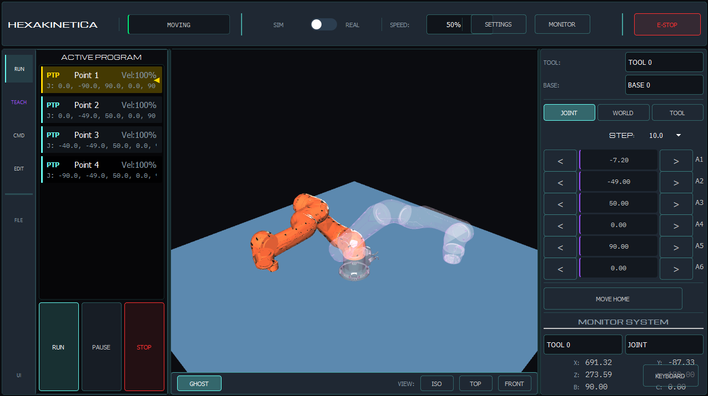
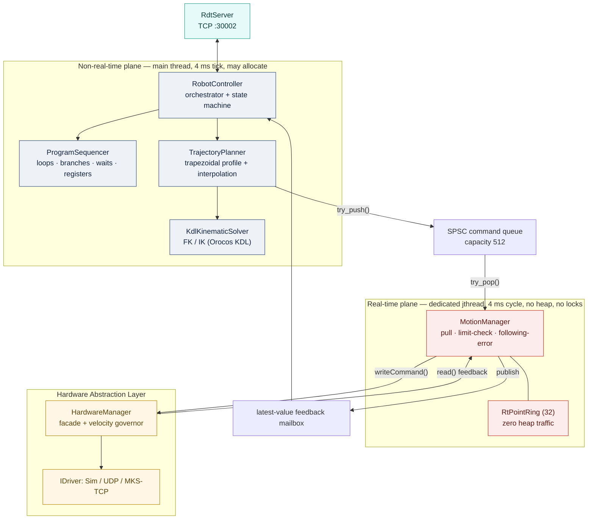
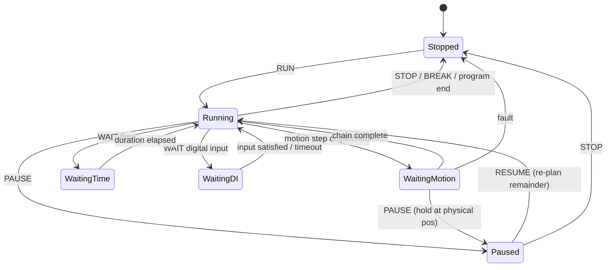
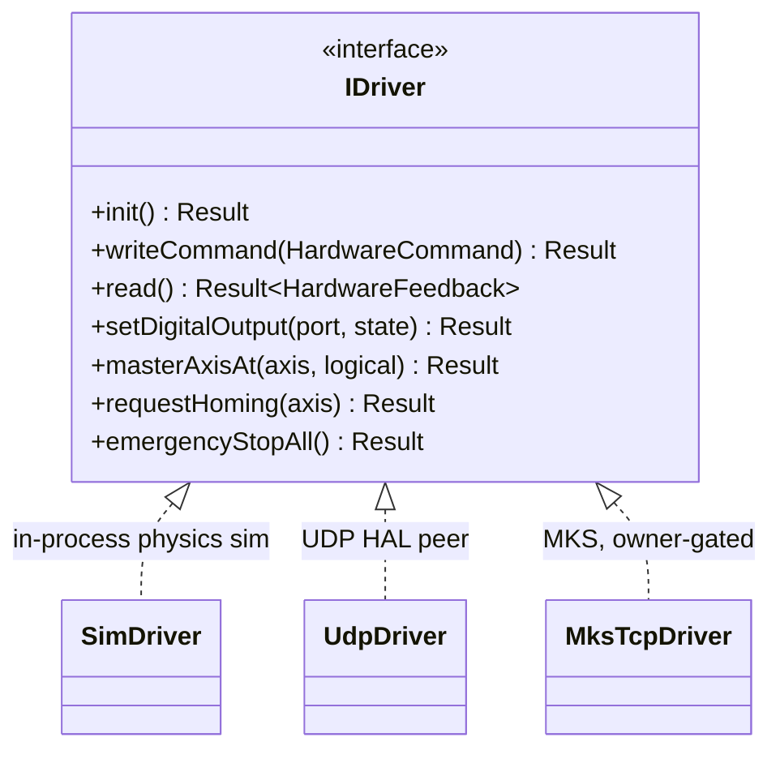

# HexaMotion — HexaCore Real-Time Controller

**A C++20 motion controller for 6-axis industrial manipulators, built on a strict real-time /
non-real-time split.**

[](https://isocpp.org/)
[](#build)
[](#execution-model)
[](../HexaMotion-SDK)
[](#license)

HexaCore is the controller half of the [HexaKinetica](../README.md) stack. It runs headless, owns all
authoritative robot state, and drives the servos through an interchangeable Hardware Abstraction Layer.
Its only network surface is the **RDT protocol** on TCP `:30002`, where the
[`HexaStudio`](../HexaStudio) HMI connects. The two processes share no memory — only data-type and
protocol definitions from [`HexaMotion-SDK`](../HexaMotion-SDK).

<p align="center">
  
  <br>
  <em>The HexaStudio HMI driving HexaCore over the RDT protocol (TCP :30002): active program, per-axis jog, and the live 3D robot view with a motion ghost.</em>
</p>

## Highlights

- **Two cooperating planes** — soft-real-time planning and hard-real-time execution — bridged by a
  single lock-free SPSC queue, the only channel across the RT boundary.
- **Zero-heap, lock-free RT loop** at **250 Hz / 4 ms**: pre-computed points drained into a fixed
  member ring, no allocations, no locks in steady state.
- **Pluggable HAL** — Sim, UDP, and MKS-TCP backends behind one `IDriver` interface; always boots in
  simulation.
- **FK/IK via Orocos KDL**, isolated behind a `KinematicSolver` interface.
- **Flat-program interpreter** — loops, branches, waits, and a 16-entry integer register file.

<details>
<summary>Contents</summary>

- [Architecture](#architecture)
  - [Execution model](#execution-model)
  - [Real-time timing budget](#real-time-timing-budget)
  - [Program execution state machine](#program-execution-state-machine)
  - [Hardware Abstraction Layer](#hardware-abstraction-layer)
- [Module breakdown](#module-breakdown)
- [Motion & program semantics](#motion--program-semantics)
- [Configuration](#configuration)
- [Build](#build)
- [Console output](#console-output)
- [Requirements & design docs](#requirements--design-docs)
- [Disclaimer](#disclaimer)
- [License](#license)

</details>

## Architecture

### Execution model

Two cooperating planes with fundamentally different timing guarantees. A **lock-free
single-producer/single-consumer queue** is the only channel by which planned motion crosses from the
soft-real-time world into the hard-real-time world.


```mermaid
flowchart TB
    classDef nrt fill:#EEF2F7,stroke:#35507A,color:#12233F;
    classDef rt  fill:#FDECEC,stroke:#C0392B,color:#5A1A14;
    classDef hal fill:#FFF6E6,stroke:#B8860B,color:#5A430A;
    classDef net fill:#E6FBF9,stroke:#2A9D8F,color:#0B3B37;

    Srv["RdtServer<br/>TCP :30002"]:::net

    subgraph NRT ["Non-real-time plane — main thread, 4 ms tick, may allocate"]
        direction TB
        Ctrl["RobotController<br/>orchestrator + state machine"]:::nrt
        Seq["ProgramSequencer<br/>loops · branches · waits · registers"]:::nrt
        Plan["TrajectoryPlanner<br/>trapezoidal profile + interpolation"]:::nrt
        Kin["KdlKinematicSolver<br/>FK / IK (Orocos KDL)"]:::nrt
        Ctrl --> Seq
        Ctrl --> Plan
        Plan --> Kin
    end

    Qin["SPSC command queue<br/>capacity 512"]
    QfB["latest-value feedback mailbox"]

    subgraph RT ["Real-time plane — dedicated jthread, 4 ms cycle, no heap, no locks"]
        MM["MotionManager<br/>pull · limit-check · following-error"]:::rt
        Ring["RtPointRing (32)<br/>zero heap traffic"]:::rt
        MM --- Ring
    end

    subgraph HALg ["Hardware Abstraction Layer"]
        Facade["HardwareManager<br/>facade + velocity governor"]:::hal
        Drv["IDriver: Sim / UDP / MKS-TCP"]:::hal
        Facade --> Drv
    end

    Srv <--> Ctrl
    Plan -->|"try_push()"| Qin
    Qin -->|"try_pop()"| MM
    MM -->|"writeCommand()"| Facade
    Facade -->|"read() feedback"| MM
    MM -->|"publish"| QfB
    QfB --> Ctrl
```

### Real-time timing budget

| Property | Value | Source |
| :--- | :--- | :--- |
| RT motion cycle | **4 ms (250 Hz)** | `MotionManager`, absolute-time paced `std::jthread` |
| RT timer resolution | 1 ms requested for the thread lifetime | Windows multimedia timer (defeats the ~15.6 ms default sleep granularity) |
| NRT controller tick | 4 ms | `main.cpp` control loop |
| Status broadcast | ~100 ms (10 Hz), configurable | `RdtServer::broadcastStatus` |
| Following-error threshold | 5° | constructor of `MotionManager` |
| Command queue | SPSC ring, capacity **512**, power-of-two, cache-line aligned | `TrajectoryQueue<T,512>` |
| RT local buffer | fixed `RtPointRing`, capacity **32**, refill threshold 25 | **zero heap allocation per cycle** |
| `TrajectoryPoint` | 800 B, trivially copyable | measured; motivates the fixed ring over `std::deque` |

Feedback flows back through a mutex-guarded latest-value mailbox — drop-oldest by construction, since
the NRT consumer only ever needs the freshest sample.

### Program execution state machine

`RobotController` owns the wall-clock servicing of blocking actions; `ProgramSequencer` decides *what*
to do next.


```mermaid
stateDiagram-v2
    [*] --> Stopped
    Stopped --> Running: RUN
    Running --> WaitingMotion: motion step dispatched
    Running --> WaitingTime: WAIT time
    Running --> WaitingDI: WAIT digital input
    WaitingMotion --> Running: chain complete
    WaitingTime --> Running: duration elapsed
    WaitingDI --> Running: input satisfied / timeout
    Running --> Paused: PAUSE
    WaitingMotion --> Paused: PAUSE (hold at physical pos)
    Paused --> Running: RESUME (re-plan remainder)
    Running --> Stopped: STOP / BREAK / program end
    Paused --> Stopped: STOP
    WaitingMotion --> Stopped: fault
```

PAUSE and STOP hold the robot at its **physical** position (a zero-length joint hold segment), so
firmware-profiling backends stop where the robot actually is. RESUME re-plans the remaining waypoints
of the interrupted chain rather than restarting the step.

### Hardware Abstraction Layer

A single `IDriver` interface isolates the control core from the physical transport. The active backend
is selected at startup from the runtime config; the HAL **always boots in simulation** — switching to a
real backend is an explicit, validated operator action.


```mermaid
classDiagram
    class IDriver {
        <<interface>>
        +init() Result
        +writeCommand(HardwareCommand) Result
        +read() Result~HardwareFeedback~
        +setDigitalOutput(port, state) Result
        +masterAxisAt(axis, logical) Result
        +requestHoming(axis) Result
        +emergencyStopAll() Result
    }
    class SimDriver
    class UdpDriver
    class MksTcpDriver
    IDriver <|.. SimDriver : in-process physics sim
    IDriver <|.. UdpDriver : UDP HAL peer
    IDriver <|.. MksTcpDriver : MKS, owner-gated
```

| Backend | Selector (`realtime_interface`) | Transport | Use |
| :--- | :--- | :--- | :--- |
| `SimDriver` | (default at boot) | in-process | Internal physics simulation; DO1–32 + DI loopback |
| `UdpDriver` | `udp` | UDP `30004`→`30003` | External HAL peer (e.g. `HexaHAL_Client` UDP mode) |
| `MksTcpDriver` | `mks_tcp` | TCP `30110` | MKS Motor Configurator; firmware-profiled motion, ownership gate |

The `HardwareManager` facade wraps the active driver with a **safety governor** that clamps commanded
velocity, and refreshes a per-axis runtime mirror each cycle as a POD slice (no per-cycle string
copies on the RT path).

## Module breakdown

Modules live under `src/HexaMotion/modules/`.

| Module | Architectural role |
| :--- | :--- |
| **`controller`** | The orchestrator. Global state machine, RDT command handling, program execution, startup coordination. |
| **`program_sequencer`** | Flat-program interpreter: motion/logic/IO steps, LABEL/GOTO, register-compare `IF`, `SET/INC/DEC VAR`, `BREAK`, runaway watchdog, fail-closed validation. |
| **`planning_nrt`** | Trajectory generation: trapezoidal velocity profiles, circular (`MoveC`) and spline (`MoveS`) paths, per-cycle interpolation to dense `TrajectoryPoint`s. |
| **`kinematics_nrt`** | FK/IK via Orocos KDL, frame transforms (WORLD/TOOL/BASE), isolated behind a `KinematicSolver` interface. |
| **`motion_manager_rt`** | The real-time heartbeat: pulls queued points, enforces position + following-error limits, drives the HAL. Never blocks, never allocates. |
| **`hardware_hal`** | `IDriver` abstraction + Sim/UDP/MKS-TCP drivers + velocity governor + digital IO. |
| **`trajectory_queue_lf`** | The lock-free SPSC ring buffer bridging NRT → RT. Power-of-two capacity, acquire/release ordering, cache-line aligned indices. |

Each module carries its own requirements document under `modules/<name>/docs/` and its own GoogleTest
suite under `modules/<name>/tests/`.

## Motion & program semantics

| Step | Meaning |
| :--- | :--- |
| `MoveJ` | Joint-interpolated move to an `AxisSet` target |
| `MoveL` | Linear (Cartesian) move to a `CartPose` |
| `MoveC` | Circular arc through an auxiliary via-point (KUKA aux-point semantics) |
| `MoveS` | Spline: a contiguous run of `MoveS` steps executes as one smooth curve |
| `WaitTime` / `WaitDI` | Timed wait / wait on a digital input level |
| `SetDO` | Drive a digital output (fail-closed if the backend has no DO channel) |
| `Label` / `JumpToLabel` / `ConditionalJump` | Flow control; `IF` branches on a DI level **or** a register compare (`==`, `!=`, `>`, `<`) |
| `SetVar` / `IncVar` / `DecVar` / `Break` | 16-entry integer register file for counter loops; immediate stop from code |

## Configuration

Two JSON files under [`configs/`](configs), resolved relative to the working directory (or via the
`HEXAMOTION_CONFIG_PATH` / `HEXAMOTION_RUNTIME_CONFIG_PATH` environment variables):

| File | Contents |
| :--- | :--- |
| [`hexacore_config.json`](configs/hexacore_config.json) | Persistent robot definition: axis limits, tool/base frames, mounting transform, `urdfPath`. Loaded **fail-closed** — an unusable file refuses startup. |
| [`hexacore_runtime_config.json`](configs/hexacore_runtime_config.json) | Ports and realtime backend selection (`rdt_server_port`, `realtime_interface`, `mks_ip`/`mks_port`, `programs_dir`). |

The kinematic model is loaded from the shared SDK URDF referenced by `urdfPath` (default:
`HexaMotion-SDK/robots/HexaArm_Mini_Nema_Assem.SLDASM5/…`) — no robot model ships inside this repo.

## Build

### Prerequisites

- Windows 10/11 (MinGW-w64 64-bit) or Linux (GCC), C++20
- CMake ≥ 3.20
- [`HexaMotion-SDK`](../HexaMotion-SDK) as a submodule (`external/HexaMotion-SDK`) or a sibling checkout

```bash
cmake -S . -B build -G "MinGW Makefiles"
cmake --build build -j 4
```

Produces `build/bin/HexaCore.exe` plus the per-module unit-test executables.

### Run

```bash
# from the repository root, so configs/ and the SDK robots/ resolve:
build/bin/HexaCore.exe
```

The controller starts in **internal simulation** mode, loads the URDF, prints its local IPv4 addresses
for the operator, and listens on `:30002` for HexaStudio connections. Press `Ctrl+C` for a graceful
shutdown.

## Console output

The service's "UI" is a structured, timestamped log (console + rotating file under
`logs/hexacore_debug.log`). A nominal startup:

```text
[INFO ] HexaCore  --- Starting HexaCore Robot Controller v0.1.13 ---
[INFO ] HexaCore  Using config file: .../configs/hexacore_config.json
[INFO ] HexaCore  Kinematic model loaded from URDF: .../HexaArm_Mini_Nema_Assem.SLDASM5.urdf
[INFO ] HexaCore  Robot limits loaded from URDF.
[INFO ] HexaCore  Configured Realtime MKS TCP Driver: 127.0.0.1:30110
[INFO ] HexaCore  RDT listen: 0.0.0.0:30002
[INFO ] HexaCore  Startup mode: INTERNAL SIMULATION
[INFO ] HexaCore  Controller is running. Press Ctrl+C to terminate.
[INFO ] HexaCore  Listening on port 30002 for HexaStudio connections.
```

## Requirements & design docs

Deep requirements, protocol/process specs, ADRs, and a generated per-class code reference live in the
workspace [requirements vault](../requirements) (open `requirements/` as an Obsidian vault; start at
[`_служебное/START_HERE.md`](../requirements/_служебное/START_HERE.md)). The code-reference layer is
regenerated from these headers by [`gen_docs.bat`](../gen_docs.bat) and gated in `build_all.bat`.

---

## Disclaimer

> [!WARNING]
> This is a **technical demonstration**. It implements industrial architectures but is not certified
> for functional safety (ISO 10218). Do not use with physical heavy machinery without independent
> safety verification and a hard-wired E-Stop circuit.

## License

Licensed under the **GNU Affero General Public License v3 (AGPLv3)** — see the [LICENSE](LICENSE) file.
If you run this software (or a derivative) to provide a service over a network, you must make the
corresponding source available to the users of that service.
