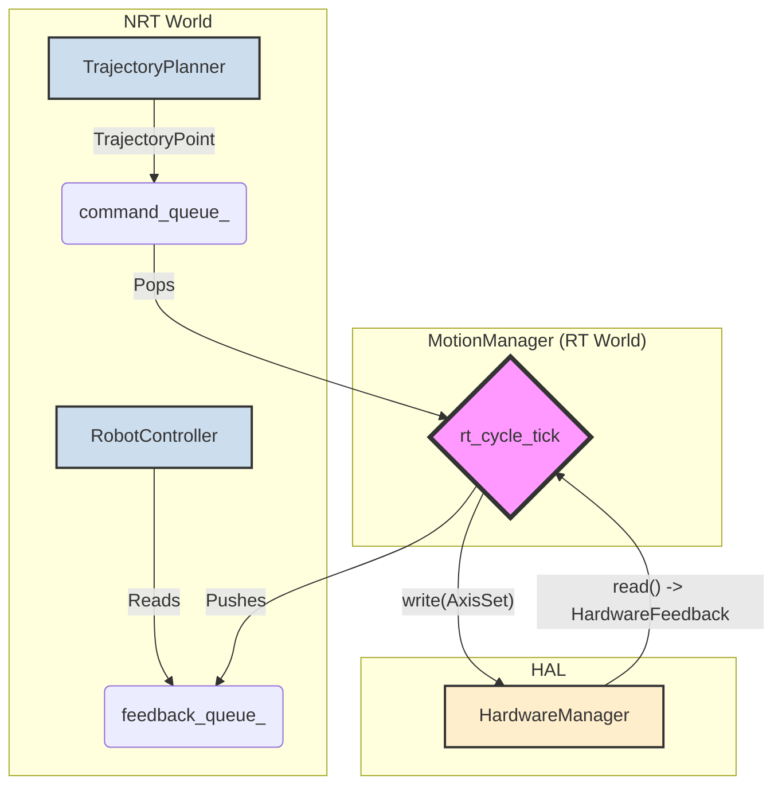

# Requirements for Module: `motion_manager_rt`

## 1. Functional Requirements

### 1.1. Core Responsibilities
- [!REQ] REQ-MM-01: **Real-Time Execution Loop**
  - **Description**: The module must operate a high-frequency, deterministic loop (the "RT-cycle"). This loop is the real-time heart of the control system. Its period must be configurable.
  - **Acceptance Criteria**: The `rt_cycle_tick()` method runs in a dedicated thread (`std::jthread`) and executes with a predictable period.

- [!REQ] REQ-MM-02: **Command Dispatcher**
  - **Description**: In each RT-cycle, the module must take the next `AxisSet` command from its internal buffer and dispatch it to the `HardwareManager` via the `write()` method.
  - **Acceptance Criteria**: `hw_manager->write()` is called exactly once per cycle.

- [!REQ] REQ-MM-03: **Feedback Aggregator**
  - **Description**: In each RT-cycle, the module must read the latest state from the `HardwareManager` via the `read()` method and package it into a `TrajectoryPoint` for upstream consumers.
  - **Acceptance Criteria**: `hw_manager->read()` is called exactly once per cycle. The resulting `TrajectoryPoint` is pushed to the feedback queue.

- [!REQ] REQ-MM-04: **SPSC Queue Interface**
  - **Description**: The module must expose a thread-safe, Single-Producer, Single-Consumer (SPSC) interface for receiving commands from the NRT world (`TrajectoryPlanner`) and sending feedback back to it (`RobotController`).
  - **Acceptance Criteria**: Public methods `enqueueCommand()` and `dequeueFeedback()` operate on lock-free queues (`TrajectoryQueue`).

### 1.2. State Management
- [!REQ] REQ-MM-05: **State Machine**
  - **Description**: The module must maintain a simple internal state machine (`RTState`: Idle, Moving, Error).
  - **Acceptance Criteria**:
    - `Idle`: The internal command buffer is empty. The manager sends "hold position" commands to the HAL.
    - `Moving`: The internal command buffer contains points. The manager sends these points sequentially.
    - `Error`: A critical fault has been detected. The manager stops processing commands and holds its state until a `reset()` is called.

- [!REQ] REQ-MM-06: **Emergency Stop & Reset**
  - **Description**: The module must provide methods to immediately halt motion (`emergencyStop()`) and to recover from an error state (`reset()`).
  - **Acceptance Criteria**: `emergencyStop()` clears all internal and external command queues and transitions the state to `Error`. `reset()` clears queues and transitions the state to `Idle`.

### 1.3. Real-Time Safety & Validation
- [!REQ] REQ-MM-07: **Trajectory Position Limit Validation**
  - **Description**: Before accepting a command from the NRT queue into its internal buffer, the module must validate the target joint positions against the configured software position limits (`RobotLimits`).
  - **Acceptance Criteria**: If a command violates a position limit, it is rejected, all queues are cleared, and the manager transitions to the `Error` state. A `PipelineDiagnostics` message with `SafetyStatus::Error_JointLimit` is generated.

- [!REQ] REQ-MM-08: **Following Error Monitoring**
  - **Description**: In every RT-cycle, the module must calculate the difference (error) between the last commanded joint position and the actual feedback position from the HAL.
  - **Acceptance Criteria**: If the error for any axis exceeds a configurable `following_error_threshold`, the manager immediately transitions to the `Error` state and generates a `PipelineDiagnostics` message with `SafetyStatus::Error_FollowingError`.

- [!REQ] REQ-MM-09: **HAL Error Propagation**
  - **Description**: The module must gracefully handle errors returned from `HardwareManager::write()` or `HardwareManager::read()`.
  - **Acceptance Criteria**: If a call to the HAL returns an error, the manager transitions to the `Error` state and propagates the HAL status in `PipelineDiagnostics`.

### 1.4. Exclusions (What this module DOES NOT do)
- [!EXCL] EXCL-MM-01: **No Trajectory Generation**
  - The module does not calculate or generate trajectories (e.g., trapezoidal profiles, splines). It only consumes pre-calculated points. This is the responsibility of `TrajectoryPlanner`.

- [!EXCL] EXCL-MM-02: **No Kinematics**
  - The module does not perform Forward or Inverse Kinematics (FK/IK). It operates exclusively in **Joint Space**. This is the responsibility of `TrajectoryPlanner` and `KinematicSolver`.

- [!EXCL] EXCL-MM-03: **No Velocity Limiting**
  - The module does not perform cycle-level velocity clamping or command subdivision. It trusts the `HardwareManager`'s "Command Governor" to ensure safety.

## 2. Non-functional Requirements (NFR)

- [!REQ] REQ-MM-NFR-01: **Deterministic Execution**
  - **Description**: The `rt_cycle_tick` loop must be free of operations that can cause non-deterministic delays.
  - **Acceptance Criteria**: The loop contains no memory allocations (`new`, `malloc`), no file I/O, no mutex locks (only atomics and lock-free queues), and no blocking system calls other than the final `sleep_until`.

- [!REQ] REQ-MM-NFR-02: **Clear Diagnostics**
  - **Description**: In case of any fault, the generated feedback `TrajectoryPoint` must contain clear, actionable diagnostic information in its `PipelineDiagnostics` member, identifying the source and nature of the fault.
  - **Acceptance Criteria**: `diagnostics.safety`, `diagnostics.hal`, and `diagnostics.failing_axis_id` are correctly populated on error.

## 3. Architecture & Diagrams

