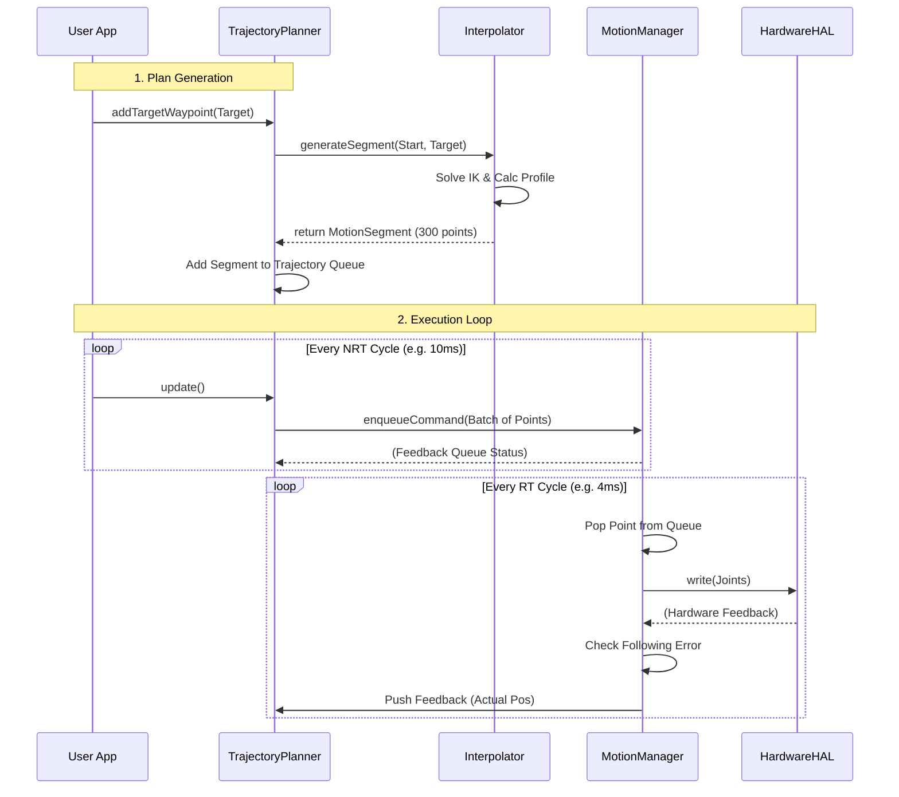

# Requirements for Module: `planning_nrt`

## 1. Introduction

The `planning_nrt` module is a high-level, Non-Real-Time (NRT) component responsible for generating smooth, safe, and kinematic-compliant trajectories for the robot. It bridges the gap between high-level user commands (like "move to point X") and the low-level, Real-Time (RT) execution layer handled by the `motion_manager_rt` module.

The primary goal of this module is to decouple trajectory *generation* (which is computationally expensive and potentially non-deterministic) from trajectory *execution* (which must be strictly deterministic and real-time safe).

## 2. Architecture Overview

The system architecture follows a producer-consumer pattern where the `TrajectoryPlanner` produces a stream of fully calculated trajectory points, and the `MotionManager` consumes them to drive the hardware.

```mermaid
graph TD
    subgraph "Application Layer (NRT)"
        UserApp[User Application / RobotController]
        UserApp -- "1. addTargetWaypoint(target)" --> Planner[TrajectoryPlanner]
        UserApp -- "2. update()" --> Planner
    end

    subgraph "Planning Layer (NRT)"
        Planner -- "3. Create Segment" --> Interpolator[TrajectoryInterpolator]
        Interpolator -- "4. Returns MotionSegment" --> Planner
        Planner -- "5. Push to Queue" --> TrajQueue[Trajectory (Queue of Segments)]
    end

    subgraph "Execution Interface"
        Planner -- "6. enqueueCommand(TrajectoryPoint)" --> MM_CmdQueue[MotionManager Command Queue]
        MM_Feedback[MotionManager Feedback Queue] -- "9. dequeueFeedback(Status)" --> Planner
    end

    subgraph "Real-Time Layer (RT)"
        MM[MotionManager]
        MM -- "7. Pop Point" --> MM_CmdQueue
        MM -- "8. Hardware IO" --> HAL[HardwareManager]
    end

    style Planner fill:#e1f5fe,stroke:#01579b,stroke-width:2px
    style MM fill:#fff9c4,stroke:#fbc02d,stroke-width:2px
    style Interpolator fill:#e1f5fe,stroke:#01579b
```

### 2.1. Key Components

*   **`TrajectoryPlanner` (Manager):** The main entry point for the module. It accepts high-level commands, manages the queue of motion segments, and handles the flow of data to the RT layer. It does *not* perform the heavy math itself.
*   **`TrajectoryInterpolator` (Factory):** A stateless or semi-stateless helper that performs the heavy lifting. It takes start/end points and constraints, solves Inverse Kinematics (IK), calculates velocity profiles (S-Curve), and produces a fully populated `MotionSegment`.
*   **`MotionSegment` (Data Container):** Represents a single continuous motion (e.g., a PTP movement from A to B). It contains a cache (vector) of pre-calculated `TrajectoryPoint`s, ready to be sent to the RT layer.
*   **`Trajectory` (Container):** Manages the sequence of `MotionSegment`s, handling transitions and queue logic.

## 3. Functional Requirements

### 3.1. Core Responsibilities
- [!REQ] REQ-PLAN-01: **Segment-Based Trajectory Model**
  - **Description**: The system must model robot motion as a sequence of `MotionSegment` objects.
  - **Rationale**: Pre-calculating entire segments ensures that the RT layer never runs out of data due to NRT latencies (provided the buffer is managed correctly).
  - **Acceptance Criteria**: `MotionSegment` stores a vector of points. `Trajectory` manages a queue of these segments.

- [!REQ] REQ-PLAN-02: **Decoupling of Generation and Execution**
  - **Description**: Heavy calculations (profile generation, IK) must happen in NRT upon segment creation. The `update()` loop must only be responsible for lightweight data copying.
  - **Acceptance Criteria**: Profiling shows that `update()` consumes minimal CPU time, while `addTargetWaypoint()` bears the load of calculation.

- [!REQ] REQ-PLAN-03: **Streaming & Buffering**
  - **Description**: The planner must feed the `MotionManager`'s command queue to keep it full (up to a limit), but not overflow it.
  - **Acceptance Criteria**: The `update()` method fills the `MotionManager` queue until it reaches `RT_BUFFER_REFILL_THRESHOLD`.

### 3.2. Operational Scenarios
- [!REQ] REQ-PLAN-04: **Program Execution**
  - **Description**: Ability to plan a multi-step trajectory from a list of waypoints.
  - **Acceptance Criteria**: A sequence of movements executes without stopping between segments (blending is a future requirement, currently stop-and-go is acceptable between distinct segments unless they are continuous).

- [!REQ] REQ-PLAN-05: **Streaming Execution**
  - **Description**: New waypoints can be added while the robot is moving.
  - **Acceptance Criteria**: Calling `addTargetWaypoint()` during motion appends the new segment to the end of the current queue.

- [!REQ] REQ-PLAN-06: **Trajectory Override**
  - **Description**: Ability to immediately cancel the current motion and start a new one.
  - **Acceptance Criteria**: `overrideTrajectory()` clears all queues and immediately plans a path from the *current* robot position to the new target.

### 3.3. Safety and Error Handling
- [!REQ] REQ-PLAN-07: **Safe API with Explicit Errors**
  - **Description**: Use `Result<T, E>` for all fallible operations. No exceptions.
  - **Acceptance Criteria**: API returns `PlannerError` enums for failures like IK unreachable or invalid arguments.

## 4. Data Flow Diagrams

### 4.1. Motion Execution Flow

This sequence diagram illustrates how a command travels from the user to the hardware and back.



## 5. Interface Specifications

### 5.1. Input Data (TrajectoryPoint)
The basic unit of communication is the `TrajectoryPoint`.
```cpp
struct TrajectoryPoint {
    struct Header {
        uint64_t timestamp_us;
        uint32_t sequence_id;
        MotionType motion_type; // JOINT, CARTESIAN, IDLE
    } header;

    struct Command {
        AxisSet joint_target;
        // CartesianTarget cart_target; // Future
        double speed_ratio;
    } command;

    struct Feedback {
        AxisSet joint_actual;
        RTState rt_state; // IDLE, MOVING, ERROR
    } feedback;
    
    // ... Diagnostics ...
};
```

### 5.2. Hardware Abstraction
The `HardwareManager` acts as a gateway. It ensures that regardless of the driver (Simulation or Real Hardware), the upper layers see a consistent interface. It also enforces safety limits via a **Governor**.

```mermaid
classDiagram
    class HardwareManager {
        +init()
        +write(cmd)
        +read()
        -applyCommandGovernor(cmd)
        -active_driver: IDriver*
    }

    class IDriver {
        <<interface>>
        +write()
        +read()
    }

    class SimDriver {
        -physical_state
        -next_report_state
        +write() // Simulates 1-cycle delay
        +read()
    }

    class UdpDriver {
        +write() // Sends UDP packet
        +read() // Receives UDP packet
    }

    HardwareManager --> IDriver
    IDriver <|-- SimDriver
    IDriver <|-- UdpDriver
```


