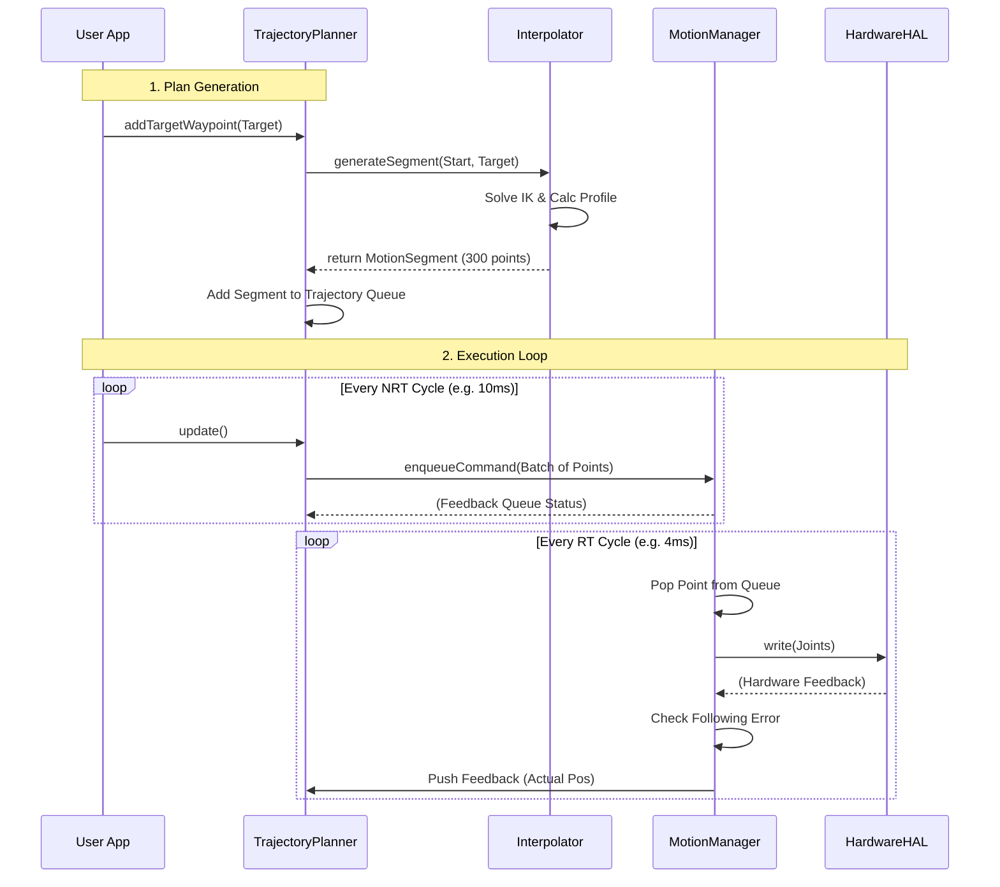
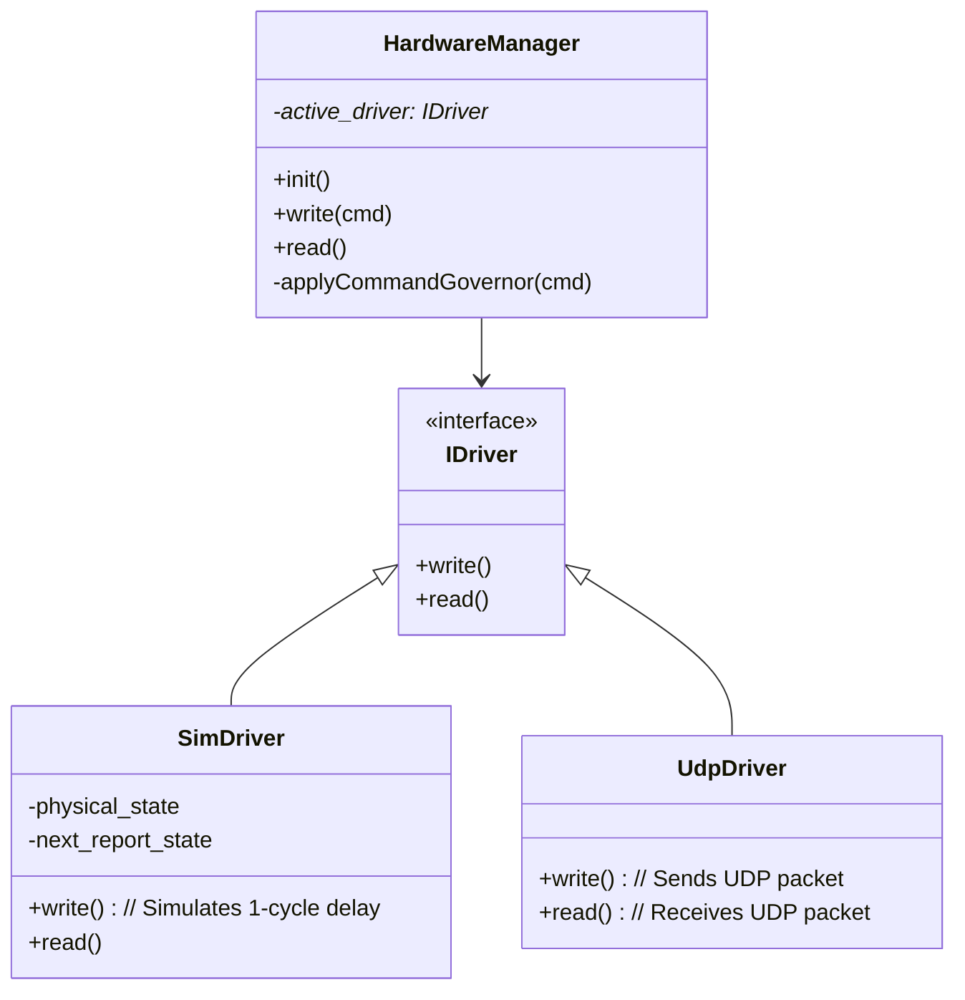

# Requirements for Module: `planning_nrt`

## 1. Introduction

The `planning_nrt` module is a high-level, Non-Real-Time (NRT) component responsible for generating smooth, safe, and kinematic-compliant trajectories for the robot. It bridges the gap between high-level user commands (like "move to point X") and the low-level, Real-Time (RT) execution layer handled by the `motion_manager_rt` module.

The primary goal of this module is to decouple trajectory *generation* (which is computationally expensive and potentially non-deterministic) from trajectory *execution* (which must be strictly deterministic and real-time safe).

## 2. Architecture Overview

The system architecture follows a producer-consumer pattern where the `TrajectoryPlanner` produces a stream of fully calculated trajectory points, and the `MotionManager` consumes them to drive the hardware.

```mermaid
graph TD
    subgraph "Application Layer (NRT)"
        UserApp[User Application / RobotController]
        UserApp -- "1. addTargetWaypoint(target)" --> Planner[TrajectoryPlanner]
        UserApp -- "2. update()" --> Planner
    end

    subgraph "Planning Layer (NRT)"
        Planner -- "3. Create Segment" --> Interpolator[TrajectoryInterpolator]
        Interpolator -- "4. Returns MotionSegment" --> Planner
        Planner -- "5. Push to Queue" --> TrajQueue[Trajectory (Queue of Segments)]
    end

    subgraph "Execution Interface"
        Planner -- "6. enqueueCommand(TrajectoryPoint)" --> MM_CmdQueue[MotionManager Command Queue]
        MM_Feedback[MotionManager Feedback Queue] -- "9. dequeueFeedback(Status)" --> Planner
    end

    subgraph "Real-Time Layer (RT)"
        MM[MotionManager]
        MM -- "7. Pop Point" --> MM_CmdQueue
        MM -- "8. Hardware IO" --> HAL[HardwareManager]
    end

    style Planner fill:#e1f5fe,stroke:#01579b,stroke-width:2px
    style MM fill:#fff9c4,stroke:#fbc02d,stroke-width:2px
    style Interpolator fill:#e1f5fe,stroke:#01579b
```

### 2.1. Key Components

*   **`TrajectoryPlanner` (Manager):** The main entry point for the module. It accepts high-level commands, manages the queue of motion segments, and handles the flow of data to the RT layer. It does *not* perform the heavy math itself.
*   **`TrajectoryInterpolator` (Factory):** A stateless or semi-stateless helper that performs the heavy lifting. It takes start/end points and constraints, solves Inverse Kinematics (IK), calculates velocity profiles (S-Curve), and produces a fully populated `MotionSegment`.
*   **`MotionSegment` (Data Container):** Represents a single continuous motion (e.g., a PTP movement from A to B). It contains a cache (vector) of pre-calculated `TrajectoryPoint`s, ready to be sent to the RT layer.
*   **`Trajectory` (Container):** Manages the sequence of `MotionSegment`s, handling transitions and queue logic.

## 3. Functional Requirements

### 3.1. Core Responsibilities
- [!REQ] REQ-PLAN-01: **Segment-Based Trajectory Model**
  - **Description**: The system must model robot motion as a sequence of `MotionSegment` objects.
  - **Rationale**: Pre-calculating entire segments ensures that the RT layer never runs out of data due to NRT latencies (provided the buffer is managed correctly).
  - **Acceptance Criteria**: `MotionSegment` stores a vector of points. `Trajectory` manages a queue of these segments.

- [!REQ] REQ-PLAN-02: **Decoupling of Generation and Execution**
  - **Description**: Heavy calculations (profile generation, IK) must happen in NRT upon segment creation. The `update()` loop must only be responsible for lightweight data copying.
  - **Acceptance Criteria**: Profiling shows that `update()` consumes minimal CPU time, while `addTargetWaypoint()` bears the load of calculation.

- [!REQ] REQ-PLAN-03: **Streaming & Buffering**
  - **Description**: The planner must feed the `MotionManager`'s command queue to keep it full (up to a limit), but not overflow it.
  - **Acceptance Criteria**: The `update()` method fills the `MotionManager` queue until it reaches `RT_BUFFER_REFILL_THRESHOLD`.

### 3.2. Operational Scenarios
- [!REQ] REQ-PLAN-04: **Program Execution**
  - **Description**: Ability to plan a multi-step trajectory from a list of waypoints.
  - **Acceptance Criteria**: A contiguous run of motion steps is planned as one continuous trajectory via
    `planMotionChain()`. Between waypoints the behavior is selected per waypoint by `blending_radius`
    (see REQ-PLAN-09/REQ-PLAN-10): radius `0` is an exact stop (fine point), radius `> 0` is a rounded
    (approximated) corner with no stop. The controller no longer waits for a full RT `Idle` before
    queuing the next motion step within the run.

- [!REQ] REQ-PLAN-05: **Streaming Execution**
  - **Description**: New waypoints can be added while the robot is moving.
  - **Acceptance Criteria**: Calling `addTargetWaypoint()` during motion appends the new segment to the end of the current queue.

- [!REQ] REQ-PLAN-06: **Trajectory Override (stop/pause hold)**
  - **Description**: Ability to immediately cancel all planned motion and hold the robot at its live position.
  - **Acceptance Criteria**: `overrideTrajectory(live_point)` clears the planner trajectory, calls
    `MotionManager::reset()` (blocking queue-clear handshake — the robot is physically held at its last
    commanded point), and replans a zero-length hold segment to `live_point`. The hold segment is
    **always planned in joint space** (`MotionType::JOINT`, `command.joint_target`), regardless of the
    motion type carried by `live_point`. Rationale: production callers
    (`RobotController::stopProgram`/`pauseProgram`) pass the latest **feedback** point, whose motion
    type echoes what the RT loop was executing — `HOLD` when the RT buffer is empty (robot already
    standing: between chain segments, in `WaitTime`/`WaitDI`, or paused), `SPLINE`/`CIRC` mid-move —
    and none of those is plannable as a single segment (`HOLD`/`SPLINE` are not `createSegment()`
    types; a `CIRC` with coincident start/via/target has no arc geometry). Regression guarded by
    `OverrideTrajectoryPlansHoldForNonPlannableFeedbackTypes`: STOP while already holding previously
    failed with `UnsupportedMotionType` (planner error 3) and planned no hold segment.

- [!REQ] REQ-PLAN-08: **Jog Re-target (supersede)**
  - **Description**: Manual jog commands must not accumulate latency. Unlike `addTargetWaypoint()` (which *appends* a segment that the `MotionManager` drains one-at-a-time behind its per-segment completion gate), a jog must supersede any unfinished/queued jog.
  - **Acceptance Criteria**: `retargetJog(target)` clears the planner trajectory, calls `MotionManager::reset()` (which blocks until the RT loop has cleared its queues — no race), and replans a fresh segment from the live `current_state_` to the new target. Repeated jog commands therefore keep only the latest target in flight; the core (planner + MotionManager) still owns and executes the motion. Used by `RobotController::handleJogRequest` for both JOINT and Cartesian jog.

- [!REQ] REQ-PLAN-09: **Continuous Motion Chain (look-ahead)**
  - **Description**: A contiguous run of program motion steps must be planned as a single continuous
    trajectory so the robot is not forced to stop, settle, and replan at every intermediate waypoint.
  - **Rationale**: Previously `RobotController` planned one waypoint at a time and only advanced after
    `isTaskFinished()` (trajectory empty **and** RT `Idle`). That imposed a full stop-and-settle plus an
    NRT replan round-trip at every waypoint. The per-waypoint stop is also enforced at the RT layer by
    `is_target_reached_for_this_point` (`MotionManager` segment-completion hold), so removing the stall
    requires fusing segments into one stream whose intermediate stop flags are cleared.
  - **Acceptance Criteria**: `TrajectoryPlanner::planMotionChain(waypoints)` renders one segment per
    waypoint (chained from `current_state_`) and fuses them into one `MotionSegment`. With all radii `0`
    the path is identical to the previous per-waypoint result (still an exact stop at each waypoint), but
    there is no NRT replan gap because subsequent points are already queued. The fused chain always ends
    with an exact stop at the final waypoint. The RT layer and HAL are unchanged.

- [!REQ] REQ-PLAN-10: **Corner Blending (approximate positioning)**
  - **Description**: When a waypoint carries `blending_radius > 0`, the corner at that waypoint must be
    rounded so the robot keeps moving through it (no stop), within the given Cartesian radius.
  - **Rationale**: Eliminates the velocity-to-zero dwell at via-points for faster, smoother paths
    (KUKA-style approximate positioning). The wire value is `ProgramStepStruct.blending_radius_mm`; the
    internal pipeline value is `TrajectoryPointHeader.blending_radius`.
  - **Method**: Joint-space overlap-add — the first `K` points of the outgoing segment (their
    displacement from the corner) are added onto the last `K` points of the incoming segment, where `K`
    is the number of points within `blending_radius` Cartesian distance of the corner on each side. This
    overlaps the deceleration tail with the acceleration head, keeping corner velocity bounded near the
    segment peak rather than summing to zero.
  - **Safety**: The blend is committed only if no resulting per-axis joint step exceeds the per-cycle
    joint-velocity ceiling (`DEFAULT_JOINT_V_MAX`). If it would, the corner safely degrades to an exact
    stop (REQ-PLAN-09 fine-point behavior) — a blend never produces an over-speed corner. Joint position
    limits remain enforced downstream by `MotionManager`. A blended waypoint is **approached, not reached
    exactly**; this is the documented meaning of a non-zero blend radius.
  - **Acceptance Criteria**: A two-segment chain with a non-zero blend radius produces a fused point
    stream in which the intermediate waypoint is not marked `is_target_reached_for_this_point` and the
    robot does not decelerate to zero at it; with radius `0` the intermediate stop flag is retained.
    Backward compatible: default `blending_radius == 0` reproduces exact-stop behavior.

### 3.3. Safety and Error Handling
- [!REQ] REQ-PLAN-07: **Safe API with Explicit Errors**
  - **Description**: Use `Result<T, E>` for all fallible operations. No exceptions.
  - **Acceptance Criteria**: API returns `PlannerError` enums for failures like IK unreachable or invalid arguments.

## 4. Data Flow Diagrams

### 4.1. Motion Execution Flow

This sequence diagram illustrates how a command travels from the user to the hardware and back.



## 5. Interface Specifications

### 5.1. Input Data (TrajectoryPoint)
The basic unit of communication is the `TrajectoryPoint`.
```cpp
struct TrajectoryPoint {
    struct Header {
        uint64_t timestamp_us;
        uint32_t sequence_id;
        MotionType motion_type; // JOINT, CARTESIAN, IDLE
    } header;

    struct Command {
        AxisSet joint_target;
        // CartesianTarget cart_target; // Future
        double speed_ratio;
    } command;

    struct Feedback {
        AxisSet joint_actual;
        RTState rt_state; // IDLE, MOVING, ERROR
    } feedback;
    
    // ... Diagnostics ...
};
```

### 5.2. Hardware Abstraction
The `HardwareManager` acts as a gateway. It ensures that regardless of the driver (Simulation or Real Hardware), the upper layers see a consistent interface. It also enforces safety limits via a **Governor**.


